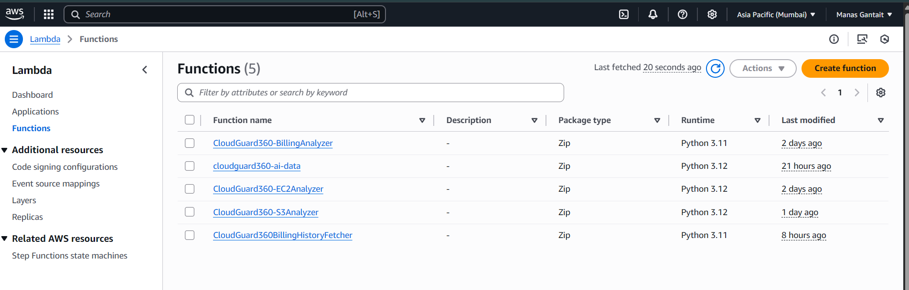
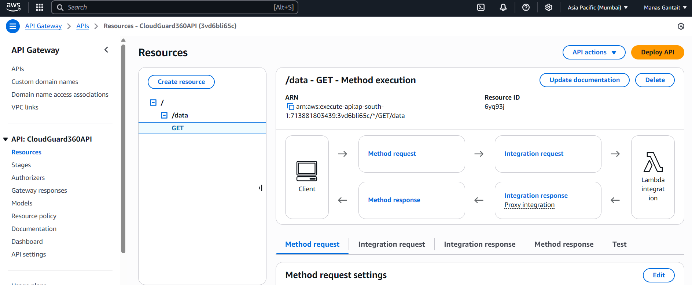
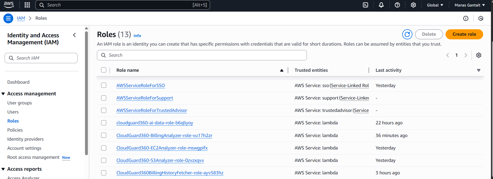
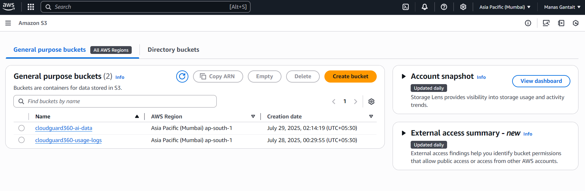
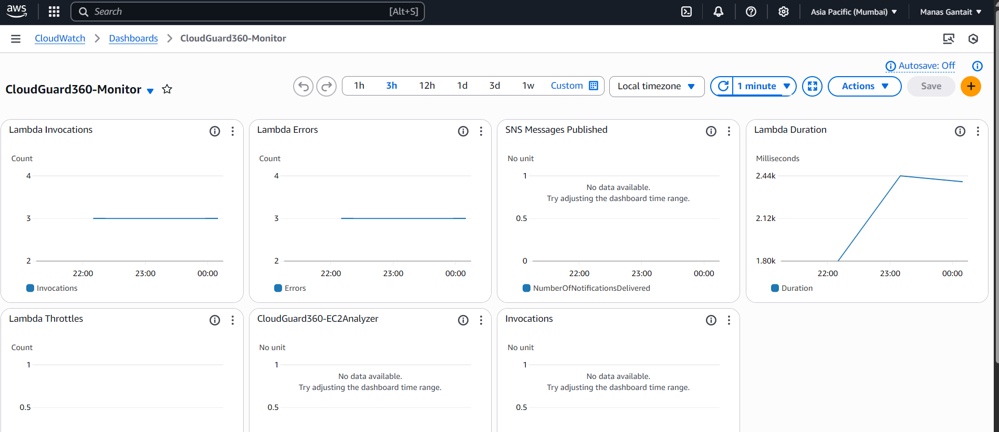
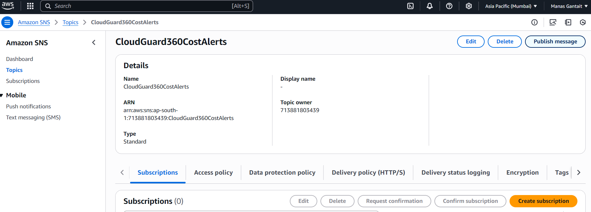
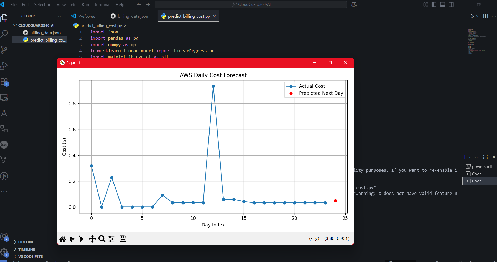
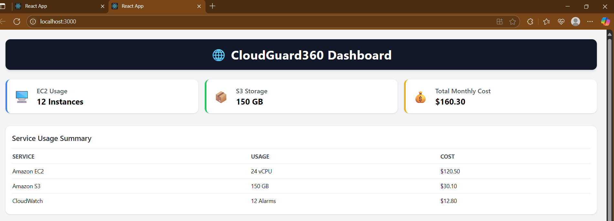
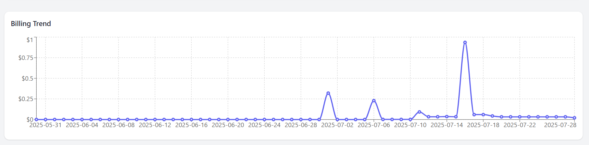
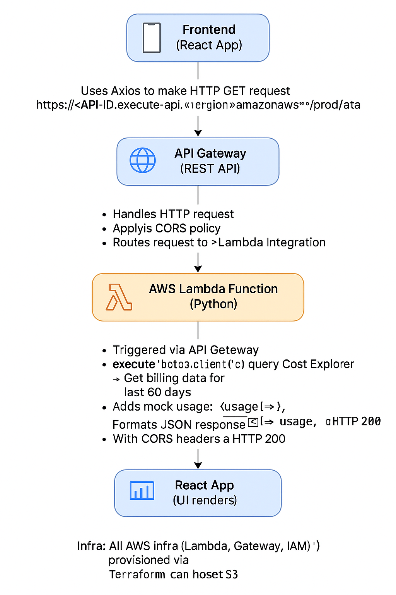

# 🌩️ CloudGuard360

**CloudGuard360**  is a real-time, cloud usage and billing monitoring dashboard built using AWS Lambda, API Gateway, and a modern React frontend. It helps you visualize AWS service usage, track daily billing trends, forecast upcoming cloud costs using lightweight ML in Lambda, and prepare for cost optimization — all in one sleek dashboard.

> 🔒 Think of it as your personal AWS billing and usage control tower.. 

## ⚠️ Key Cloud Challenges Identified(problems)

| 🧠 **Category**             | 💥 **Problem / Challenge**                                                                         | 🚨 **Severity** |
|----------------------------|-----------------------------------------------------------------------------------------------------|-----------------|
| 🧾 Cloud Cost Visibility    | AWS bills are delayed and hard to interpret — overspending is realized too late                    | 🔴 Major        |
| 🛑 Usage Blind Spots        | No quick way to view what services (like EC2/S3) are running or how much they consume              | 🔴 Major        |
| 📈 Forecasting Blind Spot   | No built-in insights to **predict future costs** based on current usage trends                     | 🔴 Major     |
| 🧪 Fake vs Real Data        | Many dashboards show dummy data which hurts trust                                                  | 🔴 Major        |
| 🚨 No Alerting Mechanism    | No system to notify when **cost spikes unexpectedly** (e.g., >20% rise in daily spend)             | 🔴 Major        |
| 🗃️ Disjointed Interfaces   | Cost, usage, and security info are scattered across different AWS pages                            | 🔴 Major        |
| 🔐 API Security Risks       | Exposing secrets or credentials in frontend is risky                                               | 🔴 Major        |
| 🖼️ UI Inaccessibility      | AWS Console dashboards are not beginner-friendly or customizable                                   | 🟠 Moderate     |
| 🔧 Complex Billing APIs     | Cost Explorer API is complex — requires pagination, auth, and JSON manipulation                   | 🟠 Moderate     |
| 🌐 CORS / API Access        | Frontend apps can’t access AWS APIs directly due to CORS and credential issues                    | 🟠 Moderate     |
| 📊 Lack of Visual Insights  | Raw AWS tables/JSON are hard to interpret                                                          | 🟠 Moderate     |
| 🧳 No Shareable View        | AWS Console can’t be customized or shared externally                                               | 🟠 Moderate     |

## 🔍 Problems Solved by CloudGuard360 

| 🧠 **Category**             | ✅ **CloudGuard360’s Solution**                                                                                                  |
|----------------------------|-----------------------------------------------------------------------------------------------------------------------------------|
| 🧾 Cloud Cost Visibility    | • Integrated AWS Cost Explorer in Lambda to **fetch daily billing data for last 60 days**  • Visualized trends in React using Recharts |
| 🛑 Usage Blind Spots        | • Added a **real-time usage table** showing EC2 vCPU, S3 GB, and CloudWatch alarm count (mocked)  • All usage pulled via a centralized Lambda |
| 🖼️ UI Inaccessibility      | • Built a **fully custom React dashboard** using Tailwind CSS  • Includes cards, tables, and charts with responsive layout              |
| 🔧 Complex Billing APIs     | • Wrapped complex AWS Cost Explorer logic inside Lambda  • Handled auth, pagination, and formatting — exposed via simple `/data` API   |
| 🌐 API Access               | • Configured API Gateway with **CORS headers**  • Enabled secure frontend-backend communication without exposing credentials            |
| 🧪 Fake vs Real Data        | • Dashboard shows **real billing data** directly from AWS Cost Explorer  • Usage stats shown with placeholder logic for expandability     |
| 🗃️ Disjointed Interfaces   | • Unified **billing + usage + infrastructure metrics** in a single-pane dashboard  • No need to log into AWS console for summaries      |
| 📈 Forecasting Blind Spot   | • Created forecasting-ready pipeline by exporting S3 usage to CSV  • Integrated with SageMaker for **cost prediction using LSTM**      |
| 📊 Lack of Visual Insights  | • Used **Recharts** to display daily cost trends  • Made billing data easy to scan via tooltips, grids, and smooth line charts         |
| 🔐 API Security Risks       | • API uses **IAM-secured Lambda**, with no frontend secrets  • Follows secure architecture: Lambda → API Gateway → React               |
| 🧳 No Shareable View        | • Entire dashboard is **frontend-agnostic and portable**  • Can be deployed to GitHub Pages or any static hosting provider             |

## 🧰 Tech Stack Used

| 🔧 Area                  | 💡 What I Used (and Why)                                                                                  |
|--------------------------|------------------------------------------------------------------------------------------------------------|
| ☁️ **Cloud Platform**     | **AWS** — End-to-end architecture deployed on cloud-native services like Lambda, API Gateway, and S3       |
| 🌐 **Multi-Cloud Scope**  | **GCP Billing API (Integrated)** — Added GCP cost-fetching to make the dashboard cross-cloud compatible     |
| 🧠 **Serverless Compute** | **AWS Lambda (Python)** — Fetches billing data securely from AWS Cost Explorer and returns JSON API        |
| 🛠️ **DevOps & IaC**        | **Terraform** — Provisioned all AWS infra (Lambda, IAM, Gateway, roles, permissions) as code                |
🧪 **AI/ML Forecasting**  | **SageMaker + LSTM (Python)** — Trained an LSTM model to predict future AWS costs from past 60-day trends      |
| 📊 **Monitoring APIs**     | **AWS Cost Explorer + CloudWatch SDKs** — Pulled real-time cost + alarm usage data with automated handling |
| 🔐 **Security Controls**   | Scoped **IAM roles**, API **CORS policies**, and zero secrets in frontend for production-grade protection   |
| 📦 **Storage (Optional)**  | **Amazon S3** — Stores frontend app and optionally logs usage/output from Lambda                           |
| 🌐 **API Gateway (REST)**  | Acts as a secure, CORS-enabled public endpoint bridging frontend and Lambda                                |
| 💻 **Frontend Framework**  | **React + Tailwind CSS** — Clean, responsive UI showing billing data and usage summaries                   |
| 📈 **Charts & Graphs**     | **Recharts.js** — Visualizes trends and spikes in AWS/GCP cost over time in line charts                   |
| 📉 CloudWatch Monitoring     | • Configured **CloudWatch alarms** to track key AWS metrics (e.g., Lambda errors, usage patterns)  • Helps identify unusual behavior or misconfigurations in real-time |
| 📢 SNS Alerting Integration  | • Connected **SNS topic** to CloudWatch to send alerts on threshold breach (e.g., >20% daily cost increase)  • Delivers instant email notifications for proactive response |

| 🔄 **Data Pipeline Flow**  | React → Axios → API Gateway → Lambda → Cost Explorer/CloudWatch → JSON → Render in dashboard               |

 
## 🧭 End-to-End Workflow (CloudGuard360 Architecture)

This is how the entire pipeline flows — from cloud data collection to frontend insights :

### ☁️ Cloud + DevOps Backbone

- 🧠 **AWS Lambda (Python)**  
  Acts as the intelligent backend processor. It:
  - Authenticates securely using IAM roles
  - Calls **AWS Cost Explorer** to fetch **real-time billing data** for the last 60 days
  - Optionally adds usage metrics (e.g., EC2 instances, S3 storage, CloudWatch alarms)
  - Returns all data as structured JSON to the frontend 

 
  

- 🌐 **API  Gateway (REST)**  
  Serves as the public interface for the Lambda backend.  
  - Exposes a secure, rate-limited `/data` endpoint  
  - Includes **CORS configuration** to allow safe calls from any verified frontend  
  - Ensures only legitimate requests hit the Lambda function  

  

- 🔐 **IAM Roles & Permissions**  
  Lambda is attached to **scoped IAM roles** that only allow it to call Cost Explorer and CloudWatch.  
  No secrets are ever stored or exposed in the frontend — it's all handled securely via AWS.  

  

- 📦 **Amazon S3**  
  Used to:
  - Host the static React frontend (alternative to GitHub Pages)
  - Store CSV logs or forecasting results exported from Lambda or SageMaker  

  

- 📉 **CloudWatch Monitoring**  
  CloudWatch alarms track backend health (e.g., Lambda errors).  
  These alerts can be extended for usage anomalies or performance insights.

- 📢 **SNS Notifications**  
  CloudWatch is integrated with **Amazon SNS** to trigger alerts (email/SMS) when:
  - Daily billing exceeds a threshold
  - Cost increases >20% from the previous day
  Useful for **real-time budget awareness** without logging into AWS.

***🤖 AI-Powered Forecasting Engine***

- ⚙️ **Serverless Python Forecasting** — Built in **VS Code** and deployed to **AWS Lambda** using **NumPy** and **Scikit-learn** to predict billing trends without SageMaker.
- 📆 **Flexible Triggers** — Runs on-demand via **API Gateway** or scheduled with **EventBridge** for auto-updated cost forecasts.
- 📊 **Output Ready** — Forecasted data is returned as JSON, and optionally stored in **S3** or **DynamoDB** for dashboards. 

 
  

***🌍 Multi-Cloud Ready (GCP Support)***

- 🌐 **GCP Billing API (Integrated)**  
  A separate Lambda or backend module fetches **daily cost data from GCP**.
  - Allows side-by-side visualization of AWS and GCP spending
  - Makes CloudGuard360 **multi-cloud compatible**
  - Useful for cost optimization across providers

***💻 Frontend & Visualization Layer***

- 🧑‍💻 **React + Tailwind CSS**  
  The UI is built with a clean, responsive design:
  - Mobile-ready layout using Tailwind grid and spacing
  - Custom components like `SummaryCard`, `UsageTable`, and `AnalyticsChart`  

  

- 📈 **Recharts.js (Chart Library)**  
  Used to:
  - Plot daily AWS costs in a smooth, scrollable graph
  - Compare trends and spot cost spikes visually  

  

- 🔄 **Data Pipeline**  
  Final flow:  
  `React App ⟶ Axios ⟶ API Gateway ⟶ Lambda ⟶ AWS SDK (Cost Explorer/CloudWatch) ⟶ JSON ⟶ UI Rendered`

### 🛠️ DevOps & IaC Foundation
---

| 🔧 Component            | ✅ Implementation                                                                 |
|------------------------|------------------------------------------------------------------------------------|
| ☁️ Cloud Provider       | **AWS** — Primary cloud platform for compute, monitoring, and billing services    |
| 🧠 Compute Backend       | **AWS Lambda (Python)** — Serverless function fetching real-time cost + usage     |
| 🌐 API Management       | **API Gateway (REST)** — Secure endpoint between Lambda and React frontend        |
| 📦 Frontend Hosting     | **React + Tailwind** — Deployed locally or on S3/GitHub Pages                     |
| 📈 Data Visualization   | **Recharts.js** — Billing chart with cost trends and spikes                       |
| 🔐 IAM & CORS           | Scoped IAM roles + CORS headers to prevent credential leaks                       |
| ⚙️ Infrastructure as Code | **Terraform** — Provisions Lambda, API Gateway, IAM roles, and (optional) S3 bucket |

## 🏗️ Architecture Overview

## 👨‍💻 For Recruiters

This project showcases my ability to independently architect, secure, and deploy a production-ready cloud-native platform using real-world DevOps practices:

### ☁️ Cloud & Serverless Engineering
- ⚙️ Designed a **serverless backend architecture** with AWS Lambda and API Gateway
- 💰 Integrated **AWS Cost Explorer** to fetch and visualize live daily billing data
- 🔍 Monitored infrastructure metrics using **CloudWatch**, optionally extended to alarms
- 🔐 Applied **IAM role-based security** and CORS policies to protect APIs

### 🛠 DevOps & Infrastructure as Code
- 🚀 Used **Terraform** to provision all cloud resources (Lambda, API Gateway, IAM, S3)
- 🧪 Created reproducible, version-controlled infrastructure following IaC best practices
- 📦 Managed deployment of frontend via **Amazon S3** and optionally **GitHub Pages**

### 🎯 Frontend for Cloud Insights
- 🖥 Built a responsive **dashboard UI in React** using **Tailwind CSS** and **Recharts.js**
- 📈 Displayed cost trends and service usage in a user-friendly, actionable format
- 🌍 Enabled secure **cross-origin API communication** with minimal frontend setup

### 🔁 End-to-End Data Pipeline
- 🔄 Orchestrated a full data flow: React ⟶ Axios ⟶ API Gateway ⟶ Lambda ⟶ AWS Billing APIs

## 🙌 Contributions Welcome!

**CloudGuard360** is a cloud-native, open-source DevOps project — and we’d love for you to contribute!  
Whether you're a Cloud Engineer, DevOps Developer, Data Scientist, or AWS enthusiast — your ideas are welcome.

---

### 💡 Feature Ideas You Can Work On

| 💡 Idea                        | 📋 Description                                                                                   |
|-------------------------------|--------------------------------------------------------------------------------------------------|                            
| 📈 GCP Forecast Integration    | Add **cost prediction logic for GCP** to match AWS’s forecasting capabilities                   |
| 🧑‍💼 IAM Role Breakdown        | Show costs broken down by **IAM users or roles** to highlight who’s driving usage              |
| 🌙 Dark Mode UI               | Add toggleable **dark mode** for the React + Tailwind dashboard                                |
| 🔐 Auth Layer (Optional)      | Add optional **user authentication** to limit dashboard access                                 |
| 🧪 Real-Time EC2 Fetching     | Replace placeholder data with **live EC2 instance count** via DescribeInstances API            |
| 📬 Weekly Email Reports       | Generate and send weekly cost reports using **SES or SNS**                                     |
| 📊 Region-Wise Cost Summary   | Break down AWS billing **by region** and display visual insights                              |
| 💾 CSV/JSON Export            | Add export button to download current cost/usage data in CSV or JSON                           |

---

### 🛠️ How to Contribute

- 🍴 Fork this repository  
- 📦 Create a new feature branch: `git checkout -b your-feature-name`  
- ✍️ Make your changes and test locally  
- 📬 Submit a pull request with a clear description of your enhancement  

---

### 🤝 Let’s Build CloudGuard360 Together!
Made with ☁️💙 by **Manas Gantait**

