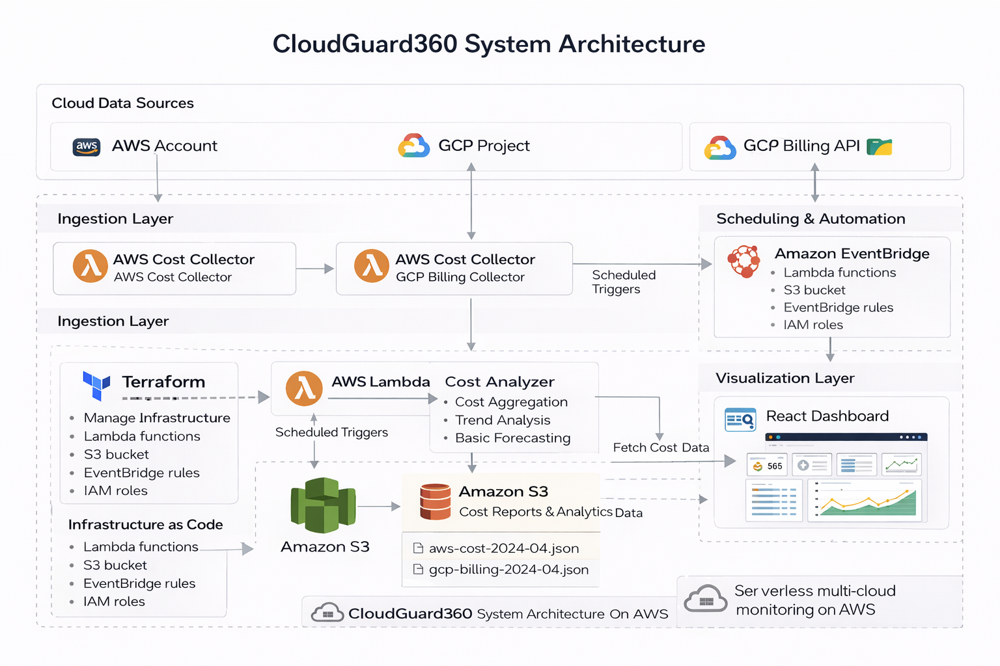

# 🌩️ CloudGuard360

**CloudGuard360**  is a real-time, cloud usage and billing monitoring dashboard built using AWS Lambda, API Gateway, and a modern React frontend. It helps you visualize AWS service usage, track daily billing trends, forecast upcoming cloud costs using lightweight ML in Lambda, and prepare for cost optimization — all in one sleek dashboard.

> 🔒 Think of it as your personal AWS billing and usage control tower..

## ⚠️ Real-Life Cloud Problems (Problem Table): 

| 💥 Problem (Real-world) | ⚙️ Solution (What I built) | 🎯 Impact |
|------------------------|---------------------------|----------|
| Cloud costs are **visible too late** (billing delay, no real-time insight) | Built Lambda integration with AWS Cost Explorer to fetch and expose **near real-time cost data via API** | Enables early detection of overspending instead of end-of-month surprises |
| Cost + usage data is **fragmented across AWS services** | Unified billing + usage into a **single API layer + React dashboard** | Single-pane visibility → faster debugging and decision making |
| AWS Cost Explorer API is **complex (auth, pagination, formatting)** | Abstracted complexity inside Lambda and exposed a **clean `/data` endpoint** | Simplifies frontend consumption and reduces engineering overhead |
| No built-in way to **predict future costs** | Designed a pipeline to export usage data and integrate with **ML-based forecasting (SageMaker)** | Enables proactive cost planning instead of reactive control |
| Frontend cannot securely access AWS APIs (**CORS + credentials issue**) | Used API Gateway + Lambda with proper **CORS and IAM-based access** | Secure, production-safe frontend-backend communication |
| Raw AWS billing data is **hard to interpret (JSON/tables)** | Built visual layer using **Recharts (trend graphs, summaries)** | Improves readability and decision speed |
| Many dashboards rely on **mock or static data** | Integrated **real AWS billing data pipeline** | Builds trust and makes system production-relevant |
| No easy way to **share or customize AWS dashboards** | Built a **portable React dashboard** deployable anywhere | Enables external sharing and customization |

## 🚀 Core Features :

| 🎯 Type | 🚀 Feature | 📝 Description |
|--------|----------|--------------|
| ✅ What This Project IS | — | A real-time cloud cost visibility platform built on serverless AWS, exposing billing insights via API and dashboard |
| ❌ What This Project is NOT | — | Not a full FinOps suite or billing replacement — focused on visibility, abstraction, and extensibility |
| ⚙️ Capability | Real-Time Cost Data API | Fetches AWS billing data via Lambda + Cost Explorer and exposes through a clean API |
| ⚙️ Capability | Unified Cost + Usage View | Combines billing and service-level usage into a single dashboard |
| ⚙️ Capability | Serverless Architecture | Built using Lambda + API Gateway with no infrastructure management |
| ⚙️ Capability | Cost Forecasting Ready | Data pipeline designed for ML-based prediction (SageMaker-ready) |
| ⚙️ Capability | Secure API Layer | Uses IAM + API Gateway to prevent credential exposure |
| ⚙️ Capability | Visualization Dashboard | React + Recharts dashboard for cost trends and insights |
| ⚙️ Capability | AWS Complexity Abstraction | Handles Cost Explorer pagination, auth, and formatting in backend |
| ⚙️ Capability | Portable Frontend | Deployable independently on static hosting platforms |
| ⚙️ Capability | Production-Oriented Design | Uses real AWS APIs with deployable architecture (not mock/demo setup) |

## 🏗️ System Architecture (Single Source of Truth) :

## 🧰 Tech Stack :

**☁️ Cloud**
AWS (Lambda, API Gateway, S3) — core serverless infrastructure  
GCP Billing API — extended for multi-cloud cost visibility  

**⚙️ Backend**
AWS Lambda (Python) — fetches and processes billing data  
API Gateway — secure, CORS-enabled API layer  

**📊 Data & Monitoring**
AWS Cost Explorer — billing data source  
CloudWatch — metrics, logs, and alarms  
SNS — alerting on abnormal cost spikes  

**🧠 Forecasting**
SageMaker (LSTM, Python) — cost prediction based on historical usage  

**🛠️ Infrastructure**
Terraform — infrastructure provisioning and IAM configuration  

**🔐 Security**
IAM roles (least privilege), no frontend secrets, controlled API access  

**💻 Frontend**
React + Tailwind CSS — responsive dashboard  
Recharts — cost visualization (trends, spikes)  

**🔄 Data Flow**
React → API Gateway → Lambda → AWS APIs → JSON → Dashboard
 
## 🧭 Data Flow / Request Lifecycle (End-to-End)

This is how the entire pipeline flows — from cloud data collection to frontend insights :

### ☁️ Cloud + DevOps Backbone

- 🧠 **AWS Lambda (Python)**  
  Acts as the intelligent backend processor. It:
  - Authenticates securely using IAM roles
  - Calls **AWS Cost Explorer** to fetch **real-time billing data** for the last 60 days
  - Optionally adds usage metrics (e.g., EC2 instances, S3 storage, CloudWatch alarms)
  - Returns all data as structured JSON to the frontend 

- 🌐 **API  Gateway (REST)**
Used to expose a secure /data endpoint for frontend access, with CORS enabled and Lambda proxy integration.

- 🔐 **IAM Roles & Permissions**  
  Lambda runs with least-privilege IAM roles limited to Cost Explorer and CloudWatch APIs.

  

- 📦 **Amazon S3**  
  Used to:
  - Host the static React frontend (alternative to GitHub Pages)
  - Store CSV logs or forecasting results exported from Lambda or SageMaker  

- 📉 **Observability & Monitoring (Logs, Metrics, Alerts)**  
Used for Lambda error monitoring and cost-spike alerting via alarms.

- 📢 **SNS Notifications**  
  CloudWatch is integrated with **Amazon SNS** to trigger alerts (email/SMS) when:
  - Daily billing exceeds a threshold
  - Cost increases >20% from the previous day
  Useful for **real-time budget awareness** without logging into AWS.

***🤖 Cost Intelligence & Forecasting Strategy (ML included, one story)***

- ⚙️ **Serverless Python Forecasting** — Built in **VS Code** and deployed to **AWS Lambda** using **NumPy** and **Scikit-learn** to predict billing trends without SageMaker.
- 📆 **Flexible Triggers** — Runs on-demand via **API Gateway** or scheduled with **EventBridge** for auto-updated cost forecasts.
- 📊 **Output Ready** — Forecasted data is returned as JSON, and optionally stored in **S3** or **DynamoDB** for dashboards. 

 
  

***🌍 Multi-Cloud Ready (GCP Support)***

- 🌐 **GCP Billing API (Integrated)**  
  A separate Lambda or backend module fetches **daily cost data from GCP**.
  - Allows side-by-side visualization of AWS and GCP spending
  - Makes CloudGuard360 **multi-cloud compatible**
  - Useful for cost optimization across providers

***💻 Frontend & Visualization Layer***

- 🧑‍💻 **React + Tailwind CSS**  
  The UI is built with a clean, responsive design:
  - Mobile-ready layout using Tailwind grid and spacing
  - Custom components like `SummaryCard`, `UsageTable`, and `AnalyticsChart`  

  

- 📈 **Recharts.js (Chart Library)**  
  Used to:
  - Plot daily AWS costs in a smooth, scrollable graph
  - Compare trends and spot cost spikes visually  

  

- 🔄 **Data Pipeline**  
  Final flow:  
  `React App ⟶ Axios ⟶ API Gateway ⟶ Lambda ⟶ AWS SDK (Cost Explorer/CloudWatch) ⟶ JSON ⟶ UI Rendered`

### 🛠️ DevOps & Infrastructure as Code

| 🔧 Component            | ✅ Implementation                                                                 |
|------------------------|------------------------------------------------------------------------------------|
| ☁️ Cloud Provider       | **AWS** — Primary cloud platform for compute, monitoring, and billing services    |
| 🧠 Compute Backend       | **AWS Lambda (Python)** — Serverless function fetching real-time cost + usage     |
| 🌐 API Management       | **API Gateway (REST)** — Secure endpoint between Lambda and React frontend        |
| 📦 Frontend Hosting     | **React + Tailwind** — Deployed locally or on S3/GitHub Pages                     |
| 📈 Data Visualization   | **Recharts.js** — Billing chart with cost trends and spikes                       |
| 🔐 IAM & CORS           | Scoped IAM roles + CORS headers to prevent credential leaks                       |
| ⚙️ Infrastructure as Code | **Terraform** — Provisions Lambda, API Gateway, IAM roles, and (optional) S3 bucket |

## ⚙️ Design Rationale

- Used **Lambda over EC2** to avoid always-on infrastructure and reduce costs ☁️
- Chose **serverless over containers** for event-driven workloads ⚡
- Built a **custom React dashboard** to unify multi-cloud views 🖥️

Design focused on **simplicity, low cost, and cloud-native patterns**.

## ✨ Key Features

- Multi-cloud cost data collection (AWS + GCP) ☁️
- Serverless analysis using AWS Lambda ⚡
- Automated cost and usage insights 📊
- Basic forecasting of spending trends 📈
- Infrastructure as Code using Terraform 🏗️
- Lightweight React dashboard for visibility 🖥️
- Scheduled analysis using event-driven workflows ⏱️
- End-to-end system built and tested in real cloud environments 🧪

## 💰 Cost Awareness & Trade-offs

- Serverless keeps compute costs near zero at low usage ☁️
- Avoided always-on EC2 instances to reduce idle costs
- Cost Explorer APIs have rate limits and data delays
- Trade-off: lower cost but not real-time accuracy

---

## ⚠️ Explicit Limitations

- Forecast accuracy depends on limited historical data 📉
- AWS billing data may be delayed by 24–48 hours ⏱️
- Not real-time cost tracking
- Some usage metrics are simplified for demonstration

## 🎯 What This Project Demonstrates About Me

- Ability to design **serverless, multi-cloud systems** ☁️
- Practical understanding of **cloud cost behavior** 💰
- Experience with **IaC, automation, and dashboards** ⚙️
- Focus on **working, testable systems** over theoretical designs 🧪

## 🙌 Contributions Welcome!

**CloudGuard360** is a cloud-native, open-source DevOps project — and we’d love for you to contribute!  
Whether you're a Cloud Engineer, DevOps Developer, Data Scientist, or AWS enthusiast — your ideas are welcome.

### 💡 Feature Ideas You Can Work On

| 💡 Idea                        | 📋 Description                                                                                   |
|-------------------------------|--------------------------------------------------------------------------------------------------|                            
| 📈 GCP Forecast Integration    | Add **cost prediction logic for GCP** to match AWS’s forecasting capabilities                   |
| 🧑‍💼 IAM Role Breakdown        | Show costs broken down by **IAM users or roles** to highlight who’s driving usage              |
| 🌙 Dark Mode UI               | Add toggleable **dark mode** for the React + Tailwind dashboard                                |
| 🔐 Auth Layer (Optional)      | Add optional **user authentication** to limit dashboard access                                 |
| 🧪 Real-Time EC2 Fetching     | Replace placeholder data with **live EC2 instance count** via DescribeInstances API            |
| 📬 Weekly Email Reports       | Generate and send weekly cost reports using **SES or SNS**                                     |
| 📊 Region-Wise Cost Summary   | Break down AWS billing **by region** and display visual insights                              |
| 💾 CSV/JSON Export            | Add export button to download current cost/usage data in CSV or JSON                           |

### 🛠️ How to Contribute

- 🍴 Fork this repository  
- 📦 Create a new feature branch: `git checkout -b your-feature-name`  
- ✍️ Make your changes and test locally  
- 📬 Submit a pull request with a clear description of your enhancement  

---

### 🤝 Let’s Build CloudGuard360 Together!
Made with ☁️💙 by **Manas Gantait**

## 🏁 Final Note

CloudGuard360 is not a billing replacement or enterprise FinOps platform.  
It is a practical, working system that collects real cloud data, analyzes it, and surfaces useful insights using serverless architecture.

The goal of this project was to design a **cost-aware, event-driven, multi-cloud monitoring system**—and prove it with real infrastructure, real data, and real execution.

If you can deploy it, inspect the pipelines, and explain the trade-offs, you understand the system—not just the code.

